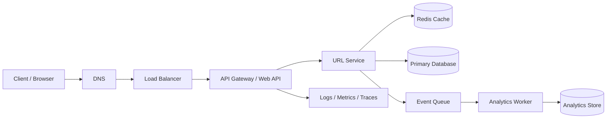
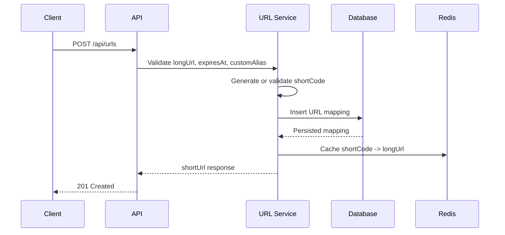
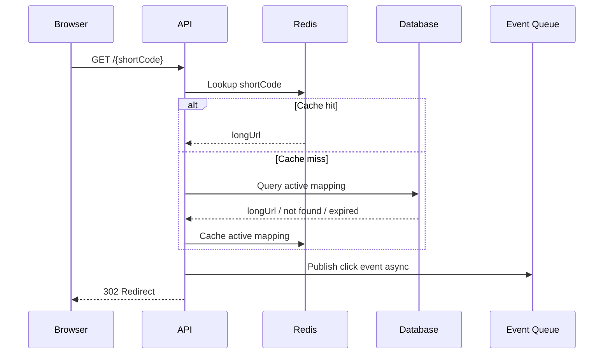

# System Design URL Shortener

This repository documents the high-level and low-level design of a scalable URL shortening service similar to Bitly or TinyURL. It covers architecture, API contracts, data model, cache strategy, scalability, availability, and operational trade-offs.

## Goals

- Generate compact, unique short URLs for long URLs.
- Redirect short URLs to their original destination with low latency.
- Support optional link expiration.
- Scale read-heavy redirect traffic horizontally.
- Keep the design simple enough to explain in system design interviews.

## Non-Goals

- Full production source code implementation.
- User authentication, billing, campaigns, or admin dashboards.
- Deep analytics pipelines beyond basic click counting.

## High-Level Design



### Core Components

| Component | Responsibility |
| --- | --- |
| Client / Browser | Calls create API or opens a short URL. |
| Load Balancer | Distributes traffic across stateless API instances. |
| API Gateway / Web API | Handles routing, validation, rate limiting, and request metadata. |
| URL Service | Owns short code generation, lookup, expiration checks, and persistence. |
| Redis Cache | Stores hot short-code lookups to reduce database reads. |
| Primary Database | Durable source of truth for URL mappings. |
| Event Queue | Buffers click events so redirects are not blocked by analytics writes. |
| Analytics Worker | Consumes click events and updates counters or analytics tables. |
| Observability | Centralized logs, metrics, traces, and alerts. |

## Low-Level Design

### Create Short URL Flow



### Redirect Flow



### Short Code Generation

Common options:

- Random Base62 code: Generate a random 6-10 character code and retry on collision.
- ID-based Base62 code: Insert a record, encode the numeric ID to Base62, then store it as the short code.
- Snowflake-style IDs: Generate distributed unique IDs and Base62 encode them.
- Custom alias: Accept a user-provided code if it passes validation and is not already taken.

For this design, a random Base62 code with database uniqueness is enough for interview scope. At high scale, Snowflake-style IDs or pre-generated code pools reduce collision retries.

## Data Model

### `url_mappings`

| Column | Type | Notes |
| --- | --- | --- |
| `id` | `BIGINT` | Primary key. |
| `short_code` | `VARCHAR(10)` | Unique, indexed lookup key. |
| `long_url` | `TEXT` | Original destination URL. |
| `created_at` | `DATETIME` | Creation timestamp. |
| `expires_at` | `DATETIME NULL` | Optional expiration timestamp. |
| `click_count` | `BIGINT` | Denormalized counter for basic analytics. |
| `is_active` | `BOOLEAN` | Allows soft disabling links. |

Recommended indexes:

- Unique index on `short_code`.
- Index on `expires_at` for cleanup jobs.
- Optional index on `created_at` for reporting and retention.

## API Design

### Create Short URL

`POST /api/urls`

Request:

```json
{
  "longUrl": "https://example.com/products?id=12345",
  "expiresAt": null,
  "customAlias": null
}
```

Response:

```json
{
  "shortCode": "QwE12R",
  "shortUrl": "https://short.ly/QwE12R",
  "expiresAt": null
}
```

Status codes:

| Status | Meaning |
| --- | --- |
| `201 Created` | Short URL was created. |
| `400 Bad Request` | Invalid URL, invalid alias, or invalid expiration. |
| `409 Conflict` | Custom alias already exists. |
| `429 Too Many Requests` | Rate limit exceeded. |

### Redirect

`GET /{shortCode}`

Behavior:

- Returns `302 Found` with `Location: {longUrl}` for active links.
- Returns `404 Not Found` if the code does not exist.
- Returns `410 Gone` if the link existed but has expired.

### Health Check

`GET /health`

Returns service status for load balancers and uptime checks.

## Cache Strategy

URL redirection is read-heavy, so cache hot short-code lookups in Redis.

### Cache Pattern

- Use cache-aside.
- On redirect, read from Redis first.
- On cache miss, read from the database and populate Redis.
- On create, write to the database first, then warm Redis with the new mapping.
- On delete, expiration, or disable, invalidate the Redis key.

### Cache Key

```text
url:{shortCode} -> {longUrl, expiresAt, isActive}
```

### TTL Policy

- If the URL has an expiration time, set Redis TTL to the remaining lifetime.
- If the URL does not expire, use a longer TTL such as 24 hours and refresh on access.
- Negative-cache missing codes briefly, for example 30-60 seconds, to reduce repeated database hits for invalid codes.

### Cache Failure Behavior

- Redis is an optimization, not the source of truth.
- If Redis is unavailable, fall back to the database.
- Protect the database with rate limits, request coalescing, and circuit breakers if cache failures cause traffic spikes.

## Scalability

- API servers are stateless and can scale horizontally.
- Database reads are reduced by Redis.
- Database writes can be partitioned by `short_code` hash or creation time if volume grows.
- Analytics writes should be asynchronous through a queue.
- CDN or edge caching can be used for extremely hot redirects, with careful expiration handling.

## Reliability and Consistency

- The primary database is the source of truth.
- Redis may be eventually consistent after creates, deletes, or expirations.
- Unique constraints on `short_code` prevent duplicate mappings.
- Redirect should prioritize availability and latency, while analytics can be eventually consistent.
- Use retries with idempotency where clients may repeat create requests.

## Security and Abuse Prevention

- Validate and normalize submitted URLs.
- Block dangerous schemes such as `javascript:` and unsupported protocols.
- Apply rate limits per IP, account, or API key.
- Add abuse detection for spam, phishing, and malware destinations.
- Consider preview pages or safe-browsing checks for public deployments.

## Detailed Docs

- [Architecture](docs/architecture.md)
- [Data Model](docs/data-model.md)
- [API Design](docs/api-design.md)
- [Sample Request](examples/sample-request.json)
- [Sample Response](examples/sample-response.json)
