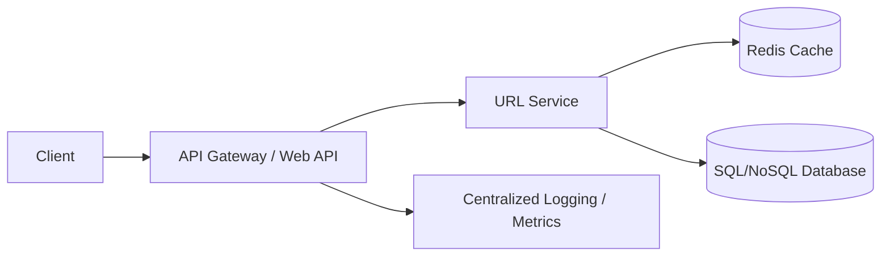

# URL Shortener – System Design (High-Level)

This project explains the high-level system design of a scalable URL Shortening service (similar to Bitly).  
It focuses on architecture, database design, caching, scalability, and API specifications.

## Features
- Generate short unique URLs
- Redirect short code ➝ original long URL
- Link expiration (optional)
- High availability & horizontal scaling

## High-Level Architecture

## Detailed Docs
- Architecture: /docs/architecture.md
- Data Models: /docs/data-model.md
- API Design: /docs/api-design.md
