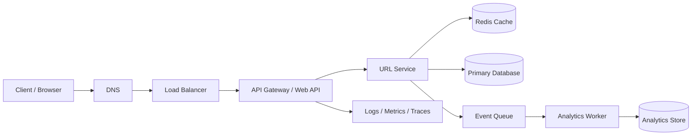
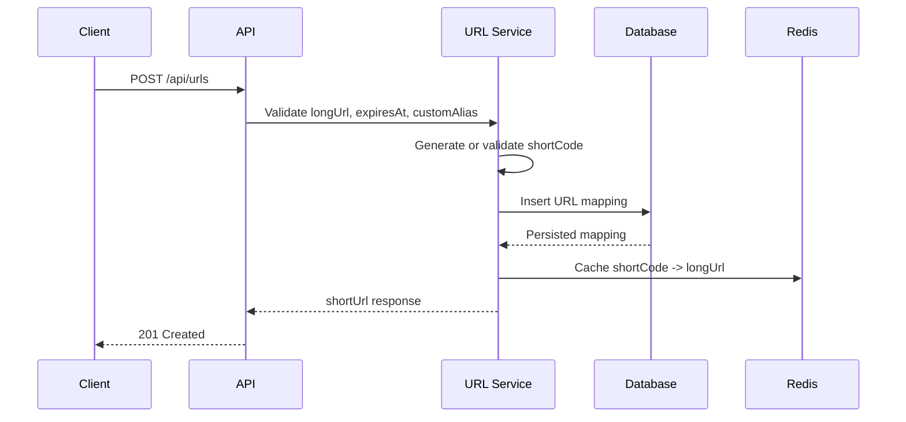
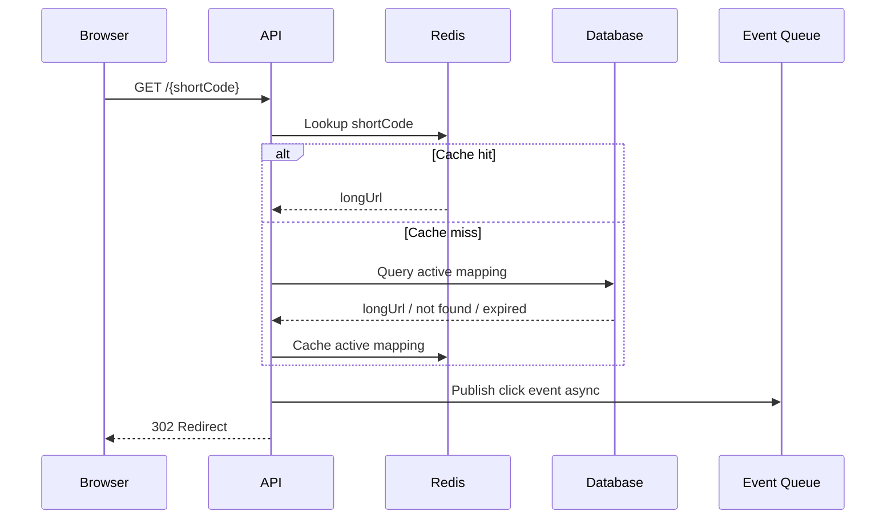

# Architecture - URL Shortener

This document expands the high-level and low-level architecture described in the README.

## High-Level Architecture

## Components

| Component | Responsibility |
| --- | --- |
| Client / Browser | Calls create API or opens a short URL. |
| Load Balancer | Distributes traffic across stateless API instances. |
| API Gateway / Web API | Handles routing, validation, rate limiting, and request metadata. |
| URL Service | Owns short code generation, lookup, expiration checks, and persistence. |
| Redis Cache | Stores hot short-code lookups to reduce database reads. |
| Primary Database | Durable source of truth for URL mappings. |
| Event Queue | Buffers click events so redirects are not blocked by analytics writes. |
| Analytics Worker | Consumes click events and updates counters or analytics tables. |
| Observability | Centralized logs, metrics, traces, and alerts. |

## Create Short URL Flow

## Redirect Flow

## Scaling Strategy

- Keep API servers stateless so they can scale horizontally.
- Use Redis to reduce database reads for redirect traffic.
- Partition database writes by `short_code` hash or creation time if volume grows.
- Publish analytics events asynchronously so redirects do not wait for analytics writes.
- Add CDN or edge caching for extremely hot redirects when expiration handling is acceptable.

## Reliability Notes

- The primary database remains the source of truth.
- Redis can be unavailable or stale; the service should fall back to the database.
- Unique database constraints prevent duplicate `short_code` values.
- Analytics can be eventually consistent because redirect latency is more important.
